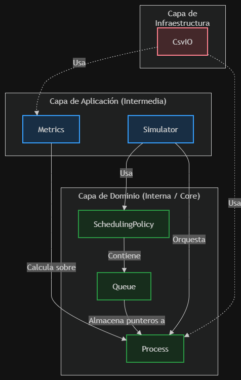

# Simulador de Planificador MLFQ (Multi-Level Feedback Queue)

Este proyecto es un simulador de planificación de procesos basado en la política **MLFQ**, desarrollado en C++17. Cumple con los requerimientos de cálculo de métricas (Response Time, Turnaround Time, Waiting Time) y exportación a `.csv`, además de haber sido diseñado bajo estrictos estándares de calidad de software y patrones de diseño.

## Compilación y Ejecución

El proyecto incluye un `Makefile` para facilitar la compilación.

*   **Para compilar y ejecutar el simulador principal:**
    ```bash
    make run
    ```
    *Esto generará el ejecutable en `bin/mlfq_simulator`, leerá el archivo `input.csv` y generará `results.csv`.*

*   **Para compilar todos los binarios de los tests:**
    ```bash
    make test
    ```

*   **Para ejecutar las pruebas unitarias (Tests):**
    Si usas PowerShell o CMD en Windows, ejecuta los binarios de prueba generados en la carpeta `bin/` manualmente:
    ```powershell
    .\bin\test_process.exe
    .\bin\test_queue.exe
    .\bin\test_demotion.exe
    .\bin\test_boost.exe
    .\bin\test_metrics.exe
    ```
    *(Nota: Si usas Linux o Git Bash en Windows, puedes simplemente ejecutar `make test`)*.

---

## Decisiones de Diseño y Arquitectura (Documento de Diseño)

Tal como se solicita en los entregables, a continuación se detallan las decisiones técnicas tomadas.

### 1. Arquitectura Limpia (Clean Architecture)

El proyecto fue estructurado siguiendo los principios de la **Arquitectura Limpia** para garantizar que la lógica central del negocio sea independiente de las interfaces de entrada/salida (I/O).

*   **Capa de Dominio (`domain`):** Contiene las reglas puras del sistema operativo (Procesos, Colas, Política MLFQ y Eventos). No tiene dependencias externas ni sabe nada de archivos CSV.
*   **Capa de Aplicación (`application`):** Orquesta los casos de uso. El `Simulator` hace avanzar el reloj y coordina la política con los procesos. `Metrics` calcula los resultados estadísticos tras la ejecución.
*   **Capa de Infraestructura (`infrastructure`):** Maneja los detalles de entrada/salida. Aquí reside `CsvIO`, que aísla las librerías estándar de C++ (`<fstream>`) del resto del sistema.

**Diagrama de Capas y Dependencias**



### 2. Principios SOLID Aplicados

*   **SRP (Single Responsibility Principle):** Cada clase tiene una única razón para cambiar. Por ejemplo, `Queue` solo maneja operaciones O(1) de encolar/desencolar y conocer su quantum; no sabe nada sobre las reglas de democión. Es `SchedulingPolicy` quien se encarga estrictamente del motor de MLFQ, y `Metrics` solo se encarga de las fórmulas matemáticas.
*   **Ocultamiento de la Información (Encapsulamiento):** Todos los atributos del `Process` (como el `remainingTime`) son privados. El estado interno solo puede modificarse de forma controlada a través de métodos expuestos como `runOneCycle()` o `demote()`.

### 3. Patrones de Diseño Justificados

*   **Strategy (Política de Planificación):**
    *   **Dónde:** `SchedulingPolicy`.
    *   **Por qué:** Al encapsular las reglas de las colas, democión y boost en una clase separada (en lugar de ponerlas directamente en el gigantesco ciclo `while` de un archivo `main`), permitimos que en el futuro el simulador pueda intercambiar políticas (por ejemplo, cambiar de MLFQ a FCFS) sin tocar el motor base de simulación (`Simulator`).
*   **Factory Method (Lectura de CSV):**
    *   **Dónde:** `CsvIO::readProcesses`.
    *   **Por qué:** Oculta la complejidad de parsear las cadenas de texto del CSV y construir los objetos `Process` complejos. Devuelve una lista de entidades limpias listas para usar.
*   **Máquina de Estados (State-like Behavior):**
    *   **Dónde:** Atributo `ProcessState` de la clase `Process`.
    *   **Por qué:** Modela perfectamente el ciclo de vida real de un proceso en un Kernel (NEW -> READY -> RUNNING -> TERMINATED). Evita modificaciones si un proceso ya se encuentra en estado *TERMINATED*.
